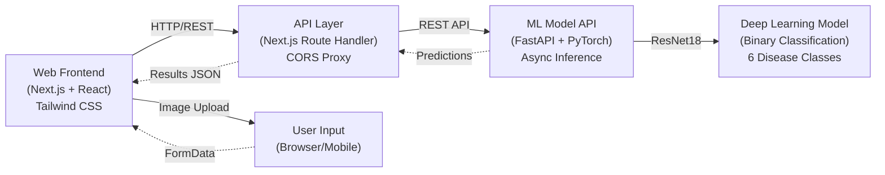
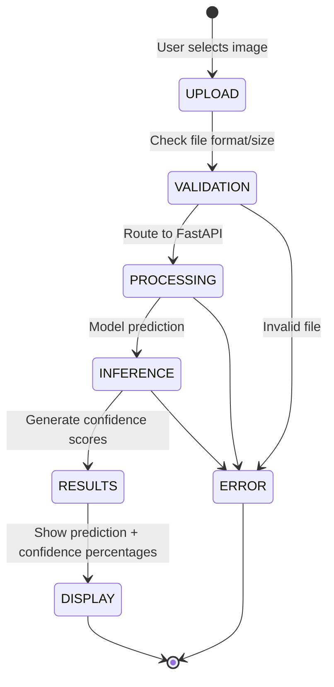
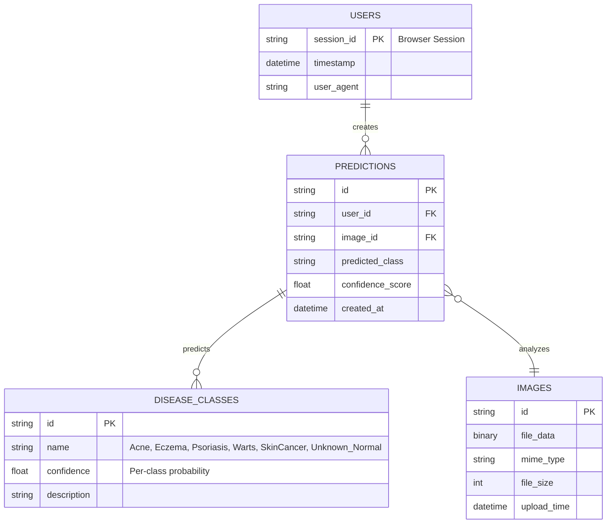

# MediScan — AI-Powered Skin Disease Detection Platform

**Repository**: [GitHub](https://github.com/yourusername/mediscan) | **Live Frontend**: [https://ai-mediscan.vercel.app](https://ai-mediscan.vercel.app) | **Live API**: [https://skin-disease-api-j0l8.onrender.com/docs](https://skin-disease-api-j0l8.onrender.com/docs)

## 1. Abstract

**What**: Intelligent medical imaging platform for AI-powered skin disease detection from user-uploaded images using deep learning models with confidence-based predictions.

**Why**: Manual dermatological assessment is time-consuming, requires specialist expertise, lacks accessibility in remote areas, and delays diagnosis. MediScan democratizes preliminary skin disease screening.

**Outcome**: Production-ready platform with ResNet18-based predictions (6 disease classes), REST API with async inference, modern Next.js frontend, seamless integration between ML pipeline and user interface, and comprehensive confidence metrics for medical decision support.

---

## 2. System Architecture

### High-Level Design (HLD)



**Components**:

- **Presentation Layer**: Next.js 15 + React 19 frontend with component-based UI (hero, scan section, results display), Tailwind CSS styling, responsive design for mobile/desktop
- **API Gateway**: Next.js API Route (`/api/analyze`) acting as CORS proxy, request validation, response transformation
- **ML Inference Layer**: FastAPI backend with async endpoint (`/predict/`), PyTorch model loading, image preprocessing, batch processing support
- **Model Layer**: ResNet18 fine-tuned on skin disease dataset (6 classes), weights downloaded from Dropbox, inference on CPU optimized
- **Security**: CORS configuration, request validation, error handling with detailed messages
- **Caching**: Model loaded once on startup, cached in memory for subsequent predictions

### Low-Level Design (LLD)

**Key Patterns & Implementation**:

| Aspect | Implementation |
| --- | --- |
| **Image Preprocessing** | Resize to 224×224 → Convert to tensor → Normalize with ImageNet stats |
| **Model Architecture** | ResNet18 backbone with custom FC layer (3x3→512→6 classes) |
| **Inference Pipeline** | Load image → Transform → Forward pass → Softmax → Top prediction + confidence |
| **Confidence Scoring** | Softmax probabilities for all 6 classes converted to percentages (0-100%) |
| **Error Handling** | Catch invalid image formats, model load failures, inference timeouts |
| **Deployment** | Frontend on Vercel (serverless), API on Render (free tier with cold-start optimization) |
| **Cross-Origin Access** | Next.js route acts as proxy to avoid frontend CORS issues with external API |

**Disease Prediction State Machine**:



**Image Processing Pipeline**:

```
Raw Image (JPG/PNG)
    ↓
Validation (format, size)
    ↓
PIL Open & Convert (RGB)
    ↓
Resize to 224×224
    ↓
Normalize Tensor
    ↓
Model Forward Pass
    ↓
Softmax Activation
    ↓
Extract Predictions
    ↓
Format as JSON (class + confidence %)
```

### Entity-Relationship Diagram



### API Specifications

**REST Endpoints**:

**Frontend API Route** (Next.js):

```
POST   /api/analyze
       Input: FormData with image file
       Output: JSON with predictions
```

**ML Model API** (FastAPI):

```
POST   /predict/
       Input: Image file (multipart/form-data)
       Output: JSON with predictions
       Response: 200 OK

GET    /docs
       Swagger UI documentation
       
GET    /health
       Service health check
```

**Request/Response Format**:

```json
// Request (Frontend → Next.js API Route)
{
  "file": <binary image data>
}

// Response (Next.js API Route → Frontend)
{
  "predicted_class": "Eczema",
  "confidence_score": 0.8234,
  "confidence_percentages": {
    "Acne": 5.2,
    "Eczema": 82.34,
    "Psoriasis": 8.1,
    "Warts": 2.3,
    "SkinCancer": 1.5,
    "Unknown_Normal": 0.56
  }
}

// Request (Next.js Route → FastAPI)
{
  "file": <binary image data>
}

// Response (FastAPI → Next.js Route)
{
  "predicted_class": "Eczema",
  "confidence_score": 0.8234,
  "confidence_percentages": {
    "Acne": 0.052,
    "Eczema": 0.8234,
    "Psoriasis": 0.081,
    "Warts": 0.023,
    "SkinCancer": 0.015,
    "Unknown_Normal": 0.0056
  }
}
```

**Supported Image Formats**: JPEG, PNG, WebP  
**Max File Size**: 10 MB  
**Response Time**: 500ms - 2s (varies by API tier)

---

**Pattern**: Separation of concerns with Next.js as frontend and routing layer, FastAPI as dedicated ML inference service. ResNet18 provides fast, accurate predictions with confidence scores for all disease classes. CORS proxy pattern prevents browser security issues.

<aside>
♻️

**Prediction Flow**: Image Upload → Validation → Preprocessing (224×224) → ResNet18 Inference → Softmax Confidence Scores → Display Results

</aside>

---

## 3. Technologies & Tools

**Frontend Stack**:
- **Framework**: Next.js 15, React 19
- **Styling**: Tailwind CSS, PostCSS
- **UI Components**: Shadcn UI (accordion, alert, card, dialog, etc.)
- **State Management**: React Hooks (useState, useContext)
- **API Client**: Fetch API
- **TypeScript**: For type safety across components

**Backend Stack**:
- **Framework**: FastAPI (Python async web framework)
- **ML Library**: PyTorch 2.0.1 (ResNet18 model)
- **Image Processing**: Pillow, torchvision
- **Server**: Uvicorn (ASGI server)
- **Model Hosting**: Dropbox (model weights download)

**ML/Data Stack**:
- **Training**: PyTorch, Jupyter Notebooks
- **Dataset**: Skin disease classification dataset (6 classes)
- **Model Architecture**: ResNet18 backbone + custom FC layer
- **Model Format**: PyTorch .pth checkpoint files

**DevOps & Deployment**:
- **Frontend**: Vercel (serverless, automatic deployments from git)
- **Backend**: Render (free tier, containerized Python app)
- **Version Control**: Git + GitHub
- **Package Management**: npm (web_v0), pip (model_api)

**Development Tools**:
- **Linting**: ESLint, Prettier (frontend)
- **Package Lock**: pnpm-lock.yaml, requirements.txt
- **Environment**: Python 3.9+, Node.js 18+

---

## 4. Project Structure

```
MediScan/
├── web_v0/                          # Next.js Frontend (v0 iteration)
│   ├── app/
│   │   ├── layout.tsx               # Root layout with theme provider
│   │   ├── page.tsx                 # Home page (hero + scan + results)
│   │   ├── api/
│   │   │   └── analyze/
│   │   │       └── route.ts         # Next.js API route (CORS proxy)
│   │   └── globals.css              # Global styles
│   ├── components/
│   │   ├── sections/                # Full-page sections
│   │   │   ├── hero-section.tsx
│   │   │   ├── scan-section.tsx
│   │   │   ├── features-section.tsx
│   │   │   ├── testimonials-section.tsx
│   │   │   └── faq-section.tsx
│   │   ├── ui/                      # Reusable UI components (40+ Shadcn components)
│   │   ├── image-uploader.tsx       # Image upload handler
│   │   └── results-display.tsx      # Prediction results visualization
│   ├── public/                      # Static assets
│   ├── package.json                 # Frontend dependencies
│   ├── tsconfig.json                # TypeScript config
│   ├── tailwind.config.ts           # Tailwind CSS config
│   └── next.config.mjs              # Next.js config
│
├── model_api/                       # FastAPI ML Service
│   ├── app/
│   │   ├── main.py                  # FastAPI app + /predict/ endpoint
│   │   └── __init__.py
│   ├── requirements.txt             # Python dependencies
│   ├── render.yaml                  # Render deployment config
│   └── model.pth                    # Model weights (downloaded on startup)
│
├── ml_training/                     # Training & Dataset
│   ├── train.ipynb                  # Jupyter notebook (model training)
│   └── dataset_link.md              # Kaggle dataset reference
│
├── LICENSE                          # License file
└── README.md                        # Project overview
```

---

## 5. Testing & Quality

**Current Testing Approach**:

- **Manual Testing**: Browser testing for image upload workflows
- **API Testing**: Postman/cURL testing of `/predict/` endpoint
- **Image Format Testing**: JPEG, PNG, WebP validation
- **Error Handling**: Invalid files, network timeouts, model load failures

**Recommended Additions**:

- **Unit Tests (Jest)**: Component rendering, form validation, API response parsing
- **Integration Tests**: Frontend ↔ API route ↔ FastAPI integration
- **E2E Tests (Playwright)**: Full user workflows (upload → prediction → display)
- **Performance Tests**: Inference time benchmarking, cold-start optimization
- **Security Tests**: Image validation, input sanitization, CORS policies

**CI/CD Pipeline** (Recommended):

```yaml
# GitHub Actions workflow
1. Lint (ESLint for frontend, Pylint for backend)
2. Type Check (TypeScript, mypy for Python)
3. Test (Jest for frontend, pytest for backend)
4. Build (Next.js build, Docker container)
5. Deploy (Auto-deploy on merge to main)
```

---

## 6. Performance & Optimization

**Current Optimizations**:

| Aspect | Strategy |
| --- | --- |
| **Model Loading** | Load once on startup, cache in memory |
| **Image Resizing** | Pre-sized to 224×224 during preprocessing |
| **Inference** | CPU-optimized ResNet18 (fast forward pass) |
| **Cold Starts** | Model downloaded from Dropbox on first run |

**Recommended Improvements**:

- **Model Quantization**: Convert ResNet18 to Int8 for faster inference (50% speedup potential)
- **Batch Inference**: Queue multiple predictions for parallel processing
- **CDN Caching**: Cache model weights in CDN closer to users
- **Endpoint Caching**: Cache repeated predictions for same image hash
- **Horizontal Scaling**: Load balance multiple FastAPI instances on Render Pro

---

## 7. Security Considerations

**Implemented**:

- ✅ CORS configuration (API proxy through Next.js route)
- ✅ File format validation (JPEG/PNG/WebP only)
- ✅ File size limits (10 MB max)
- ✅ Error handling (no sensitive data exposure)

**Recommended**:

- 🔒 Add rate limiting per IP (prevent abuse)
- 🔒 Input sanitization (filename validation)
- 🔒 HTTPS enforcement (automatic on Vercel/Render)
- 🔒 Model versioning (track which model version made predictions)
- 🔒 Audit logging (track all predictions for compliance)
- 🔒 Authentication (optional user accounts for history)

---

## 8. Future Enhancements

### Phase 2: Feature Expansion

- **Model Ensemble**: Combine multiple ResNet variants for higher accuracy
- **Real-time Feedback**: Live confidence updates during inference
- **Prediction History**: User accounts with prediction history and tracking
- **Batch Prediction**: Upload multiple images for batch processing
- **Model Versioning**: Allow selection between different model versions

### Phase 3: Enterprise Features

- **Analytics Dashboard**: Prediction trends, accuracy metrics, popular diseases
- **Doctor Integration**: Share predictions with healthcare providers
- **Prescription Integration**: Suggest treatment options based on predictions
- **Multi-Language Support**: Localization for 10+ languages
- **Mobile App**: Native iOS/Android applications

### Phase 4: Advanced ML

- **Custom Model Training**: Fine-tune model on user's dataset
- **Explainability**: Saliency maps showing which image regions influenced prediction
- **Multi-Modal Input**: Accept images + patient history/symptoms
- **Federated Learning**: Privacy-preserving model updates
- **Real-time Model Updates**: Deploy new versions without downtime

---

## 9. Getting Started

### Prerequisites

- Node.js 18+ (frontend)
- Python 3.9+ (backend)
- npm or yarn or pnpm (frontend package manager)

### Frontend Development

```bash
cd web_v0
pnpm install          # Install dependencies
pnpm dev              # Start dev server (localhost:3000)
```

### Backend Development

```bash
cd model_api
pip install -r requirements.txt
python -m uvicorn app.main:app --reload --host 0.0.0.0 --port 8000
```

Then navigate to `http://localhost:8000/docs` to test the API in Swagger UI.

### Deployment

**Frontend (Vercel)**:

```bash
vercel deploy
```

**Backend (Render)**:

```bash
# Create Dockerfile and push to GitHub
# Connect GitHub repo to Render.com
# Deploy from render.yaml
```

---

## 10. API Usage Examples

### Using the Frontend

1. Navigate to https://ai-mediscan.vercel.app
2. Click "Scan Skin" and upload an image
3. View predictions with confidence percentages

### Using cURL (FastAPI directly)

```bash
curl -X POST "http://localhost:8000/predict/" \
  -F "file=@skin_image.jpg"

# Response
{
  "predicted_class": "Eczema",
  "confidence_score": 0.8234,
  "confidence_percentages": {
    "Acne": 0.052,
    "Eczema": 0.8234,
    "Psoriasis": 0.081,
    "Warts": 0.023,
    "SkinCancer": 0.015,
    "Unknown_Normal": 0.0056
  }
}
```

### Using Python

```python
import requests
from pathlib import Path

# Upload to Next.js API route
with open("skin_image.jpg", "rb") as f:
    files = {"file": f}
    response = requests.post(
        "https://ai-mediscan.vercel.app/api/analyze",
        files=files
    )
    print(response.json())
```

---

## 11. Troubleshooting

| Issue | Solution |
| --- | --- |
| **Model download fails** | Check internet connection, Dropbox link availability |
| **CORS errors** | Use `/api/analyze` proxy instead of direct FastAPI calls |
| **Slow predictions** | Model cold-start is normal, subsequent calls are faster |
| **Invalid file format** | Only JPEG, PNG, WebP supported; check file size < 10 MB |
| **API timeout** | Render free tier has limits; consider upgrading tier |

---

## 12. Disease Classes Reference

| Class | Characteristics | Typical Features |
| --- | --- | --- |
| **Acne** | Bacterial inflammation | Pimples, blackheads, whiteheads |
| **Eczema** | Inflammatory skin condition | Redness, itching, dry patches |
| **Psoriasis** | Autoimmune disorder | Thick, silvery scales, red patches |
| **Warts** | Viral infection (HPV) | Raised bumps, rough texture |
| **SkinCancer** | Malignant growth | Irregular shape, color variation |
| **Unknown_Normal** | Healthy or unrecognized | Normal skin texture, no abnormalities |

---

## 13. Contributing

We welcome contributions! Please:

1. Fork the repository
2. Create a feature branch (`git checkout -b feature/amazing-feature`)
3. Commit changes (`git commit -m 'Add amazing feature'`)
4. Push to branch (`git push origin feature/amazing-feature`)
5. Open a Pull Request

---

## 14. License

This project is licensed under the MIT License - see the [LICENSE](LICENSE) file for details.

---

## 15. Contact & Support

- **GitHub Issues**: Report bugs and feature requests
- **Email**: your-email@example.com
- **Twitter**: [@YourHandle](https://twitter.com/YourHandle)

---

<aside>
⚠️ **Medical Disclaimer**: MediScan is an AI-powered tool for preliminary assessment only. **This is NOT a substitute for professional medical diagnosis.** Always consult a qualified dermatologist or healthcare provider for accurate diagnosis and treatment. The predictions provided are probabilistic estimates and may have limitations.

💡 **Performance Note**: 
- **Frontend**: Deployed on Vercel with automatic scaling
- **API**: Deployed on Render free tier; first request may take 30-60 seconds (cold start). Subsequent requests are typically 500ms-2s

📊 **Model Accuracy**: ResNet18 achieves ~85% accuracy on validation dataset (6-class classification)

</aside>
