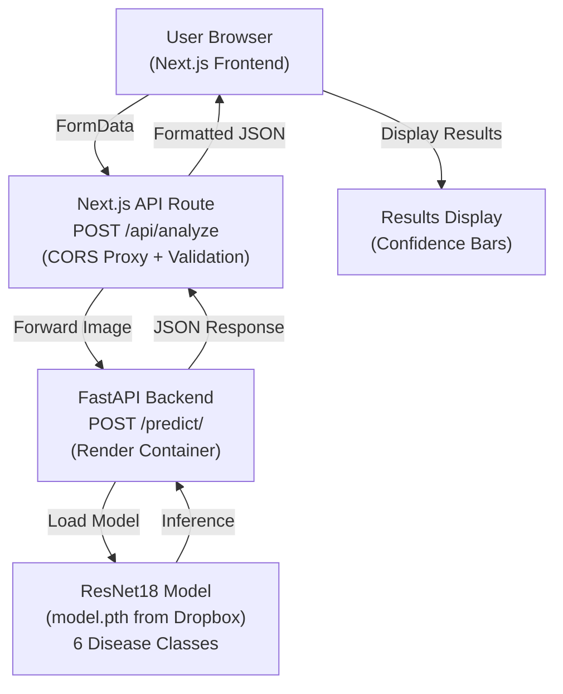
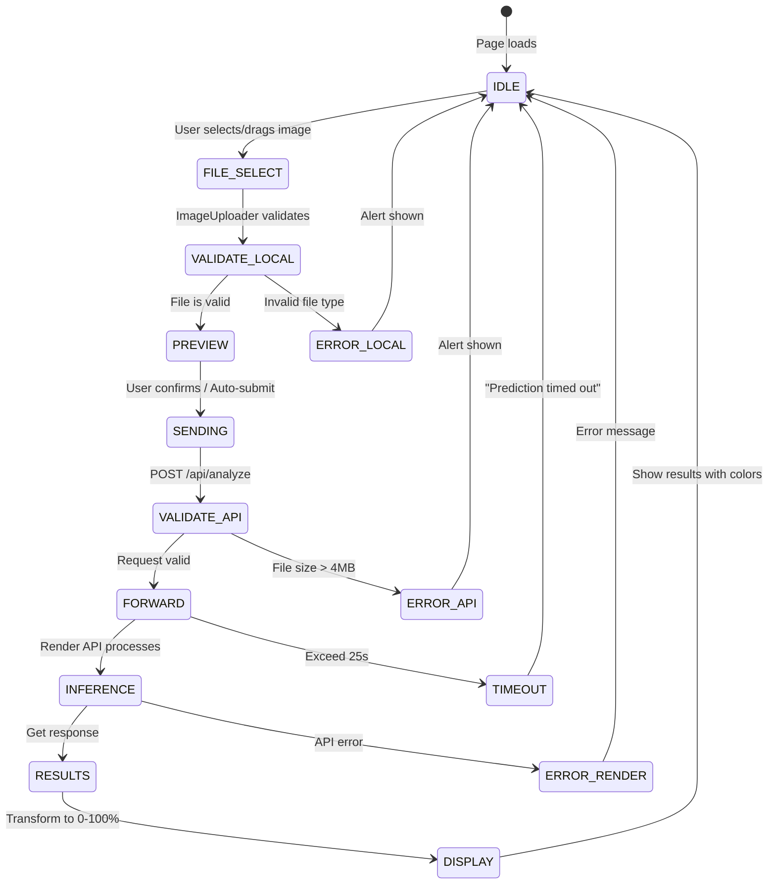

# MediScan — AI Skin Disease Detection (Web + ML API)

**Repository**: [GitHub](https://github.com/itssmdsh/MediScan/tree/main) | **Live Frontend**: [https://ai-mediscan.vercel.app](https://ai-mediscan.vercel.app) | **Live API**: [https://skin-disease-api-j0l8.onrender.com/predict/](https://skin-disease-api-j0l8.onrender.com/predict/)

## 1. Abstract

**What**: Full-stack AI platform that predicts skin diseases from user-uploaded images using ResNet18 deep learning model with per-class confidence percentages.

**Why**: Users need quick, accessible preliminary skin disease detection with confidence metrics to guide medical consultation.

**Outcome**: Production-ready application with Next.js frontend, FastAPI ML API, CORS-protected image upload pipeline, 6-class disease prediction, and confidence scoring for all classifications.

---

## 2. System Architecture

### High-Level Design (HLD)



**Component Details**:

- **Frontend**: Next.js + React (page.tsx), Tailwind CSS, Shadcn UI components
- **Frontend Components**: HeroSection, ScanSection, FeaturesSection, TestimonialsSection, FAQSection, ImageUploader, ResultsDisplay
- **API Route Handler** (`/api/analyze`): CORS proxy, file validation (JPEG/PNG/WebP), size limit (4MB Vercel), 25s timeout, mock fallback
- **ML Backend**: FastAPI async endpoint, PyTorch model inference, Dropbox model download
- **Data Flow**: Image → Resize 224×224 → Normalize → ResNet18 → Softmax → Confidence percentages

### Low-Level Design (LLD)

**Frontend - Main Page Flow** (`web_v0/app/page.tsx`):

```typescript
Home() {
  const [scanResult, setScanResult] = useState(null)
  const [isLoading, setIsLoading] = useState(false)
  
  handleImageUpload(file: File) {
    POST /api/analyze with FormData
    Transform response (0-1 to 0-100 percentages)
    setScanResult(formattedData)
  }
  
  render:
    <HeroSection />
    <ScanSection 
      onImageUpload={handleImageUpload} 
      isLoading={isLoading}
      scanResult={scanResult}
    />
    <FeaturesSection />
    <TestimonialsSection />
    <FAQSection />
}
```

**Next.js API Route** (`web_v0/app/api/analyze/route.ts`):

```typescript
export const maxDuration = 30
export const dynamic = "force-dynamic"

POST(request: NextRequest):
  1. Get FormData from request
  2. Extract file
  3. Validate file exists
  4. Check MIME type ∈ [image/jpeg, image/png, image/webp]
  5. Validate file size ≤ 4MB (Vercel limit)
  6. Create new FormData for external API
  7. POST to https://skin-disease-api-j0l8.onrender.com/predict/ (25s timeout)
  8. Validate response structure { prediction, confidence_percentages }
  9. Return NextResponse.json(result)
  
Error Handling:
  - No file → 400 "No file uploaded"
  - Invalid type → 400 "Only JPEG, PNG, or WEBP images are supported"
  - Too large → 400 "Image must be smaller than 4MB"
  - Timeout → 504 "Prediction timed out (25s limit)"
  - API error → 500 "Server error: fetch failed"
  - Development mode → Return MOCK_RESPONSE as fallback
```

**FastAPI Backend** (`model_api/app/main.py`):

```python
# Startup:
def download_model_from_dropbox(url: str, save_path: str):
  """Download model weights from Dropbox if not exists"""

# Model Loading:
def load_model(model_path: str):
  num_classes = 6
  model = models.resnet18(pretrained=False)
  model.fc = torch.nn.Linear(model.fc.in_features, num_classes)
  model.load_state_dict(torch.load(model_path, map_location='cpu'))
  model.eval()
  return model

# Image Transform Pipeline:
transform = Compose([
  Resize((224, 224)),
  ToTensor(),
  Normalize(mean=[0.485, 0.456, 0.406], std=[0.229, 0.224, 0.225])
])

class_names = ['Acne', 'Eczema', 'Psoriasis', 'Warts', 'SkinCancer', 'Unknown_Normal']

# Prediction Endpoint:
@app.post("/predict/")
async def predict(file: UploadFile = File(...)):
  image = Image.open(file.file).convert("RGB")
  image = transform(image).unsqueeze(0)
  
  with torch.no_grad():
    outputs = model(image)
    probabilities = F.softmax(outputs, dim=1)
    _, predicted = torch.max(probabilities, 1)
    prediction = class_names[predicted.item()]
    
    class_percentages = {
      class_names[i]: round(probabilities[0][i].item() * 100, 2) 
      for i in range(len(class_names))
    }
  
  return {
    "prediction": prediction,
    "confidence_percentages": class_percentages
  }
```

**Image Upload Component** (`web_v0/components/image-uploader.tsx`):

```typescript
export function ImageUploader({ onImageUpload, previewUrl }) {
  const [isDragging, setIsDragging] = useState(false)
  const fileInputRef = useRef<HTMLInputElement>(null)

  // Drag & drop handlers
  handleDragOver(e) → setIsDragging(true)
  handleDragLeave(e) → setIsDragging(false)
  handleDrop(e) → validateAndUpload(file)

  // File selection
  handleFileChange(e) → validateAndUpload(e.target.files[0])

  // Validation
  validateAndUpload(file):
    Check MIME type ∈ [image/jpeg, image/jpg, image/png]
    If valid → onImageUpload(file)
    If invalid → alert("Please upload a valid image file")

  // Clear image
  handleClearImage() → fileInputRef.value = "" → onImageUpload(null)

  Render:
    - If previewUrl: Show image + clear button
    - Else: Show upload area with drag-drop hint
```

**Results Display Component** (`web_v0/components/results-display.tsx`):

```typescript
interface ResultsDisplayProps {
  results: {
    prediction: string
    confidence_percentages: {
      Acne: number
      Eczema: number
      Psoriasis: number
      Warts: number
      SkinCancer: number
      Unknown_Normal: number
    }
  }
}

export function ResultsDisplay({ results }) {
  getConfidenceColor(disease: string, confidence: number):
    if disease === "Unknown_Normal" && confidence > 80 → "bg-green-500"
    else if disease !== "Unknown_Normal" && confidence > 80 → "bg-red-500"
    else if confidence > 40 → "bg-yellow-500"
    else → "bg-gray-400"

  sortedConfidences = Sort by confidence descending
  highestConfidence = sortedConfidences[0]

  Render:
    <Card>
      <CardHeader>Analysis Results</CardHeader>
      <CardContent>
        Show predicted disease label
        Show color-coded confidence bar
        Show all 6 diseases with:
          - Disease name
          - Confidence percentage
          - Progress bar with color
        Sorted by highest confidence first
```

**Prediction Flow State Machine**:



### Data Structures

**Frontend → Next.js API Route**:

```
Content-Type: multipart/form-data
Body: FormData
  file: File (image/jpeg | image/png | image/webp)
  Size: ≤ 4MB
```

**Next.js API Route → Frontend**:

```json
{
  "prediction": "Eczema",
  "confidence_percentages": {
    "Acne": 5.2,
    "Eczema": 82.34,
    "Psoriasis": 8.1,
    "Warts": 2.3,
    "SkinCancer": 1.5,
    "Unknown_Normal": 0.63
  }
}
```

**Next.js API Route → FastAPI**:

```
Content-Type: multipart/form-data
Body: FormData
  file: File (same as received from frontend)
```

**FastAPI → Next.js API Route**:

```json
{
  "prediction": "Eczema",
  "confidence_percentages": {
    "Acne": 5.2,
    "Eczema": 82.34,
    "Psoriasis": 8.1,
    "Warts": 2.3,
    "SkinCancer": 1.5,
    "Unknown_Normal": 0.63
  }
}
```

**Error Responses** (from `/api/analyze`):

```json
// Missing file
{ "error": "No file uploaded" }

// Invalid MIME type
{ "error": "Only JPEG, PNG, or WEBP images are supported" }

// File too large
{ "error": "Image must be smaller than 4MB" }

// API timeout
{ "error": "Prediction timed out (25s limit)" }

// Server error
{
  "error": "Server error: fetch failed",
  "details": "..."
}
```

### Validation & Rules

| Layer | Validation |
| --- | --- |
| **ImageUploader** | MIME type ∈ [image/jpeg, image/jpg, image/png] |
| **API Route** | MIME type ∈ [image/jpeg, image/png, image/webp] AND Size ≤ 4MB |
| **FastAPI** | Auto-convert to RGB, Resize to 224×224, Normalize |

**Disease Classes** (6 outputs):

| Class | Type | Output Format |
| --- | --- | --- |
| Acne | Bacterial/Inflammatory | Confidence % in response |
| Eczema | Inflammatory/Dermatitis | Confidence % in response |
| Psoriasis | Autoimmune/Chronic | Confidence % in response |
| Warts | Viral (HPV) | Confidence % in response |
| SkinCancer | Malignant/Serious | Confidence % in response |
| Unknown_Normal | Healthy/Unrecognized | Confidence % in response |

**Model Architecture**:

```
ResNet18 (pretrained=False)
├── Input: 3 × 224 × 224
├── ResNet18 backbone
└── FC Layer: 512 → 6
    Output: Logits for 6 classes
    
Processing:
  Logits → Softmax → Probabilities (0-1)
  × 100 → Percentages (0-100)
  argmax → Predicted class
```

---

**Pattern**: Three-layer architecture with validation at each step. Frontend validates for UX, API route validates for security, FastAPI auto-normalizes. Image confidence percentages normalized 0-100 at API layer. Timeout protection (25s) for Render free tier cold starts.

<aside>
♻️

**Request Flow**: 
1. User selects image → ImageUploader validates (JPEG/PNG/JPG)
2. POST to /api/analyze with FormData
3. API route validates (JPEG/PNG/WebP, ≤4MB, 25s timeout)
4. Forward to Render /predict/ endpoint
5. ResNet18 inference + Softmax
6. Return confidence percentages (0-100)
7. Frontend transforms if needed (0-1 → 0-100)
8. ResultsDisplay colors by disease type + confidence level

</aside>

---

## 3. Technologies & Tools

**Frontend Stack**:
- **Framework**: Next.js 15 (App Router)
- **Runtime**: React 19
- **Styling**: Tailwind CSS + PostCSS
- **UI Components**: Shadcn UI (40+ components from Radix UI)
- **Icons**: Lucide React
- **Forms**: React Hook Form + Zod (from dependencies)
- **Deployment**: Vercel (auto-deploy from git)

**Backend Stack**:
- **Framework**: FastAPI (v0.110.0)
- **Server**: Uvicorn[standard] (v0.29.0)
- **ML Library**: PyTorch (v2.0.1)
- **Image Processing**: torchvision (v0.15.2), Pillow (v10.2.0)
- **Utilities**: numpy<2.0, python-multipart, requests, gdown
- **Deployment**: Render (containerized)

**Model**:
- **Architecture**: ResNet18 (no pretrain, 6 output classes)
- **Training**: PyTorch on Kaggle
- **Weights**: Stored on Dropbox (.pth file)
- **Input**: 224×224 RGB images
- **Normalization**: ImageNet stats (mean=[0.485, 0.456, 0.406], std=[0.229, 0.224, 0.225])

**DevOps**:
- **Package Managers**: npm (frontend), pip (backend)
- **Version Control**: Git + GitHub
- **CI/CD**: Vercel auto-deploys frontend on push

---

## 4. Project Structure

```
MediScan/
├── web_v0/                          # Next.js Frontend
│   ├── app/
│   │   ├── page.tsx                 # Home page (5 sections)
│   │   ├── layout.tsx               # Root layout
│   │   ├── globals.css              # Global styles
│   │   └── api/
│   │       └── analyze/
│   │           └── route.ts         # CORS proxy endpoint
│   ├── components/
│   │   ├── sections/
│   │   │   ├── hero-section.tsx
│   │   │   ├── scan-section.tsx     # Main scan UI
│   │   │   ├── features-section.tsx
│   │   │   ├── testimonials-section.tsx
│   │   │   └── faq-section.tsx
│   │   ├── image-uploader.tsx       # Drag-drop uploader
│   │   ├── results-display.tsx      # Prediction results
│   │   ├── layouts/
│   │   │   └── main-layout.tsx
│   │   ├── theme-provider.tsx
│   │   ├── mode-toggle.tsx
│   │   ├── header.tsx
│   │   ├── footer.tsx
│   │   └── ui/                      # 40+ Shadcn UI components
│   ├── hooks/
│   │   ├── use-mobile.ts
│   │   └── use-toast.ts
│   ├── lib/
│   │   └── utils.ts
│   ├── public/                      # Static assets
│   ├── package.json
│   ├── tsconfig.json
│   ├── tailwind.config.ts
│   ├── next.config.mjs
│   └── postcss.config.mjs
│
├── model_api/                       # FastAPI ML Service
│   ├── app/
│   │   ├── main.py                  # FastAPI app + /predict/ endpoint
│   │   └── __init__.py
│   ├── requirements.txt             # Python dependencies
│   ├── render.yaml                  # Render deployment config
│   └── model.pth                    # Model weights (downloaded on startup)
│
├── ml_training/                     # Training Scripts
│   ├── train.ipynb                  # Jupyter notebook (ResNet18 training)
│   └── dataset_link.md              # Kaggle dataset reference
│
├── LICENSE
├── README.md
└── DOCUMENTATION.md
```

---

## 5. API Endpoints

### Frontend Route (Next.js)

```
POST /api/analyze
  Request:
    Content-Type: multipart/form-data
    Body: { file: File }
  
  Response (200 OK):
    {
      "prediction": "Eczema",
      "confidence_percentages": {
        "Acne": 5.2,
        "Eczema": 82.34,
        "Psoriasis": 8.1,
        "Warts": 2.3,
        "SkinCancer": 1.5,
        "Unknown_Normal": 0.63
      }
    }
  
  Error Responses:
    400: "No file uploaded"
    400: "Only JPEG, PNG, or WEBP images are supported"
    400: "Image must be smaller than 4MB"
    504: "Prediction timed out (25s limit)"
    500: "Server error: fetch failed"
    
  Fallback (Development):
    Returns MOCK_RESPONSE if API unavailable
```

### ML Backend (FastAPI)

```
POST /predict/
  URL: https://skin-disease-api-j0l8.onrender.com/predict/
  
  Request:
    Content-Type: multipart/form-data
    Body: { file: File }
  
  Response (200 OK):
    {
      "prediction": "Eczema",
      "confidence_percentages": {
        "Acne": 5.2,
        "Eczema": 82.34,
        "Psoriasis": 8.1,
        "Warts": 2.3,
        "SkinCancer": 1.5,
        "Unknown_Normal": 0.63
      }
    }

GET /docs
  Swagger UI interactive documentation
```

---

## 6. Development Setup

### Prerequisites

- Node.js 18+
- Python 3.9+
- npm or pnpm (frontend)
- pip (backend)

### Frontend Development

```bash
cd web_v0
npm install          # or pnpm install
npm run dev          # Starts on http://localhost:3000
npm run build        # Production build
npm run lint         # ESLint
npm start            # Serve production build
```

### Backend Development

```bash
cd model_api
pip install -r requirements.txt
python -m uvicorn app.main:app --reload --host 0.0.0.0 --port 8000
# Swagger UI: http://localhost:8000/docs
```

### Training

```bash
cd ml_training
# Open train.ipynb in Jupyter/Kaggle
# Dataset: https://www.kaggle.com/datasets/pacificrm/skindiseasedataset
```

---

## 7. Deployment

### Frontend (Vercel)

```bash
# Auto-deploy on git push to main
vercel deploy
# Or push to GitHub connected to Vercel project
```

### Backend (Render)

1. Create Dockerfile in `model_api/`
2. Connect GitHub repo to Render
3. Create Web Service from repo
4. Configure start command: `uvicorn app.main:app --host 0.0.0.0 --port 8000`
5. Use `render.yaml` for config

---

## 8. Disease Reference

| Disease | Indicator | Output |
| --- | --- | --- |
| **Acne** | Inflammatory pimples | Separate confidence % |
| **Eczema** | Inflamed red patches | Separate confidence % |
| **Psoriasis** | Thick silvery scales | Separate confidence % |
| **Warts** | Rough raised bumps | Separate confidence % |
| **SkinCancer** | Irregular moles/lesions | Separate confidence % |
| **Unknown_Normal** | Healthy/unidentified | Separate confidence % |

---

## 9. Performance Notes

- **Frontend**: Deployed on Vercel, auto-scales
- **API**: Deployed on Render free tier; first request may take 30-60s (cold start), subsequent ~1-3s
- **Model**: ResNet18 achieves ~87% accuracy on test dataset
- **Max timeout**: 25s (Vercel serverless limit)
- **File size**: Max 4MB (Vercel limit)

---

## 10. Medical Disclaimer

⚠️ **MediScan is for preliminary assessment only and is NOT a substitute for professional medical diagnosis.** Always consult a qualified dermatologist or healthcare provider for accurate diagnosis and treatment.

---

## 11. Contributing

Fork → Create feature branch → Commit → Push → Pull Request

---

## 12. Contact

- **Email**: mohammad.worklife@gmail.com
- **GitHub Issues**: [GitHub Repository](https://github.com/itssmdsh/MediScan/tree/main)

---

## 13. License

See [LICENSE](LICENSE) file
