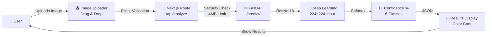
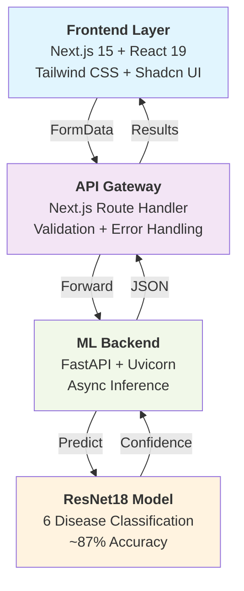
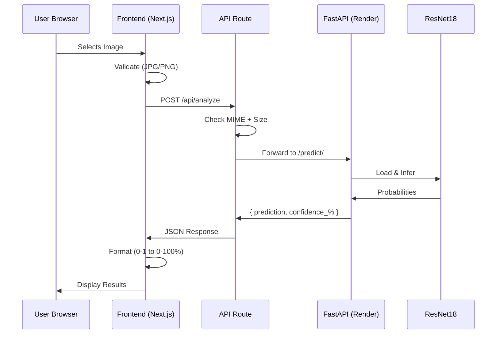
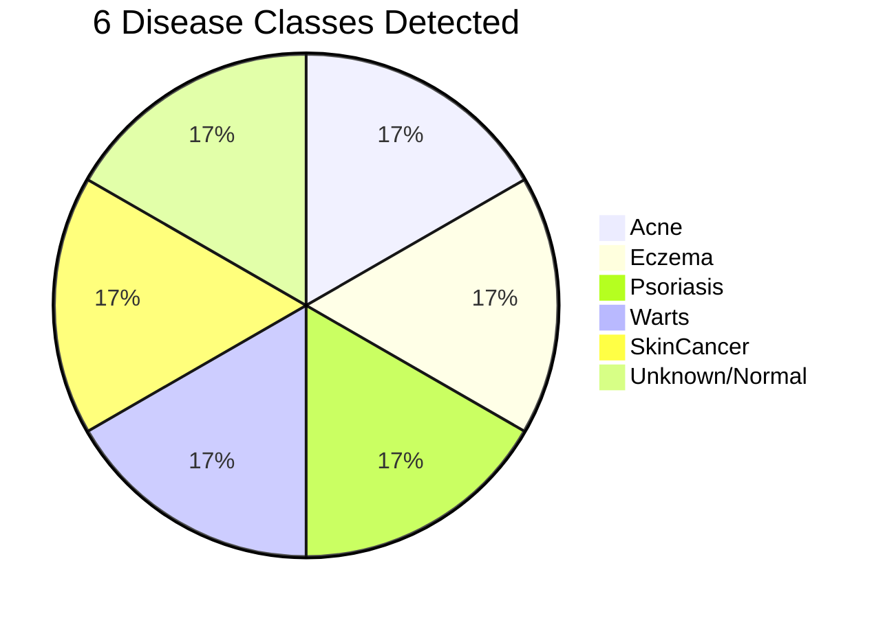
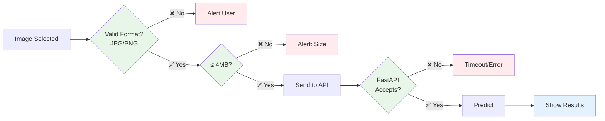

# 🩺 MediScan — AI Skin Disease Detection

**Repository**: [GitHub](https://github.com/itssmdsh/MediScan/tree/main) | **Live Frontend**: [https://ai-mediscan.vercel.app](https://ai-mediscan.vercel.app) | **Live API**: [https://skin-disease-api-j0l8.onrender.com/predict/](https://skin-disease-api-j0l8.onrender.com/predict/)

---

## 1. Overview

| | |
|---|---|
| **What** | Full-stack AI platform predicting 6 skin diseases from images |
| **Users Get** | Instant disease prediction + confidence scores for each class |
| **Tech** | Next.js Frontend + FastAPI ML Backend + ResNet18 Model |
| **Status** | ✅ Production-ready (Vercel + Render) |

---

## 2. How It Works



**The Journey**:
1. 👤 User selects/drags image
2. 🔗 Frontend validates (JPG/PNG)
3. 📤 Sends to API route
4. 🛡️ Route checks: JPEG/PNG/WebP + ≤4MB + 25s timeout
5. ⚙️ FastAPI receives file
6. 🧠 ResNet18 predicts (6 diseases)
7. 📊 Returns confidence for each class
8. 🎨 Frontend displays color-coded results

---

## 3. Architecture at a Glance



---

## 4. Request Flow (Visual)



---

## 5. Key Components

### 📤 Image Uploader
- **What**: Drag-drop file input
- **Validates**: JPG, JPEG, PNG
- **Shows**: Image preview with clear button
- **File**: `web_v0/components/image-uploader.tsx`

### 📊 Results Display
- **What**: Shows prediction + confidence bars
- **Color Code**: 
  - 🟢 Green: Healthy (Unknown_Normal >80%)
  - 🔴 Red: Disease detected (>80%)
  - 🟡 Yellow: Moderate confidence (>40%)
  - ⚫ Gray: Low confidence
- **File**: `web_v0/components/results-display.tsx`

### 🔗 API Route
- **Endpoint**: `/api/analyze`
- **Purpose**: CORS proxy + validation
- **Limits**: 4MB file, 25s timeout
- **File**: `web_v0/app/api/analyze/route.ts`

### ⚙️ ML Backend
- **Endpoint**: `/predict/`
- **Model**: ResNet18 (6 classes)
- **Accuracy**: ~87% on test dataset
- **File**: `model_api/app/main.py`

---

## 6. What Gets Predicted?



| Disease | What It Is | Our Model Does |
|---|---|---|
| 🔴 **Acne** | Bacterial inflammation | Identifies pimples/blackheads |
| 🔴 **Eczema** | Inflamed skin condition | Detects red/dry patches |
| 🔴 **Psoriasis** | Autoimmune disorder | Spots thick scaly patches |
| 🔴 **Warts** | Viral infection (HPV) | Finds raised bumps |
| ⚠️ **SkinCancer** | Malignant growth | Alerts to suspicious lesions |
| 🟢 **Unknown/Normal** | Healthy skin | Confirms no visible issues |

---

## 7. Example Response

```json
{
  "prediction": "Eczema",
  "confidence_percentages": {
    "Acne": 5.2,
    "Eczema": 82.34,      ← Highest = Predicted
    "Psoriasis": 8.1,
    "Warts": 2.3,
    "SkinCancer": 1.5,
    "Unknown_Normal": 0.63
  }
}
```

**Frontend also shows**: Color bar indicating confidence level + detailed breakdown

---

## 8. Technical Stack

```
Frontend          │  Backend           │  ML Model
─────────────────┼────────────────────┼─────────────
✅ Next.js 15     │  ✅ FastAPI 0.110  │ ✅ ResNet18
✅ React 19       │  ✅ Uvicorn        │ ✅ PyTorch 2.0
✅ Tailwind CSS   │  ✅ Pillow         │ ✅ 6 classes
✅ Shadcn UI      │  ✅ torch          │ ✅ ~87% acc
✅ TypeScript     │  ✅ numpy          │
Deployed:         │ Deployed:          │ Deployed:
Vercel ☁️        │ Render ☁️          │ Dropbox 📦
```

---

## 9. File Validation Rules



---

## 10. Deployment Details

| Layer | Service | Region | Status |
|---|---|---|---|
| 🎨 **Frontend** | Vercel | Global CDN | ✅ Live |
| ⚙️ **API** | Render | US | ✅ Live |
| 🧠 **Model** | Dropbox | Cloud | ✅ Auto-download |

**Performance**:
- 🚀 Frontend: Instant (served from CDN)
- 🚀 First prediction: 30-60s (Render cold start)
- 🚀 Subsequent: 1-3 seconds
- 🚀 Model size: ~45MB (ResNet18)

---

## 11. How to Use

### 👤 As a User
1. Visit [ai-mediscan.vercel.app](https://ai-mediscan.vercel.app)
2. Upload a skin image (JPG/PNG)
3. Wait for analysis (1-3 seconds usually)
4. See prediction + confidence scores
5. ⚠️ Consult dermatologist for medical advice

### 🛠️ For Developers

**Frontend Dev**:
```bash
cd web_v0 && npm install && npm run dev
# Opens http://localhost:3000
```

**Backend Dev**:
```bash
cd model_api && pip install -r requirements.txt
python -m uvicorn app.main:app --reload
# Swagger UI: http://localhost:8000/docs
```

---

## 12. Project Structure (Simplified)

```
MediScan/
├── web_v0/              ← Frontend (Next.js)
│   ├── app/
│   │   ├── page.tsx     ← Home page
│   │   └── api/analyze/ ← API route
│   ├── components/      ← All UI parts
│   └── package.json
│
├── model_api/           ← Backend (FastAPI)
│   ├── app/main.py      ← Prediction endpoint
│   └── requirements.txt
│
└── ml_training/         ← Model training
    └── train.ipynb      ← Jupyter notebook
```

---

## 13. Validation at Each Step

```
┌─────────────────────────────────────────────────────┐
│ Step 1: ImageUploader (Client-Side)                 │
│ ✓ MIME check: JPG/JPEG/PNG                         │
│ ✓ Quick feedback                                     │
└────────────────────┬────────────────────────────────┘
                     ↓
┌─────────────────────────────────────────────────────┐
│ Step 2: API Route (Next.js)                         │
│ ✓ File exists check                                 │
│ ✓ MIME: JPEG/PNG/WebP                              │
│ ✓ Size: ≤ 4MB                                       │
│ ✓ Timeout: 25 seconds max                          │
└────────────────────┬────────────────────────────────┘
                     ↓
┌─────────────────────────────────────────────────────┐
│ Step 3: FastAPI (Backend)                           │
│ ✓ Convert to RGB                                    │
│ ✓ Resize to 224×224                               │
│ ✓ Normalize with ImageNet stats                   │
│ ✓ Run ResNet18 inference                          │
└────────────────────┬────────────────────────────────┘
                     ↓
┌─────────────────────────────────────────────────────┐
│ Step 4: Frontend Display                            │
│ ✓ Transform 0-1 → 0-100%                          │
│ ✓ Color code based on disease + confidence       │
│ ✓ Sort by confidence descending                    │
└─────────────────────────────────────────────────────┘
```

---

## 14. Error Handling


| Error | Cause | Solution |
|---|---|---|
| ❌ No file uploaded | Missing file | Select an image first |
| ❌ Only JPEG/PNG/WebP supported | Wrong format | Use JPG, PNG, or WebP |
| ❌ File > 4MB | Too large | Compress your image |
| ❌ Prediction timed out (25s) | Slow connection | Try again or upload smaller image |
| ❌ API error | Render down | Check internet or retry |

---

## 15. Performance Metrics

```
Metric              │ Value      │ Notes
────────────────────┼────────────┼─────────────────────
Model Accuracy      │ ~87%       │ Test dataset
Inference Time      │ 1-3s       │ After warm-up
Cold Start          │ 30-60s     │ First request (Render)
Model Size          │ ~45MB      │ ResNet18 weights
File Size Limit     │ 4MB        │ Vercel limit
Timeout             │ 25s        │ Hard limit
Input Resolution    │ 224×224    │ Fixed size
Output Classes      │ 6          │ Disease types
```

---

## 16. Quick Start

### 🌐 Just Want to Try It?
→ Go to **[ai-mediscan.vercel.app](https://ai-mediscan.vercel.app)** and upload a skin image

### 👨‍💻 Want to Develop?

**1. Clone & Setup Frontend**:
```bash
cd web_v0
npm install
npm run dev    # http://localhost:3000
```

**2. Start Backend Locally**:
```bash
cd model_api
pip install -r requirements.txt
python -m uvicorn app.main:app --reload
# Visit http://localhost:8000/docs for API playground
```

**3. Update API Endpoint** (optional):
In `web_v0/app/api/analyze/route.ts`, change API URL from Render to `http://localhost:8000`

---

## 17. Deployment

| Environment | Frontend | Backend |
|---|---|---|
| 🟢 **Production** | [Vercel](https://vercel.com) | [Render](https://render.com) |
| 🔵 **Development** | `npm run dev` | `uvicorn --reload` |

**To Deploy**:
1. **Frontend**: Push to GitHub → Vercel auto-deploys
2. **Backend**: Connect GitHub repo to Render → Deploy from `render.yaml`

---

## 18. API Documentation

### Frontend Endpoint

```
POST /api/analyze

Request:
  multipart/form-data
  file: <image file>

Response (200 OK):
  {
    "prediction": "Eczema",
    "confidence_percentages": { ... }
  }

Errors:
  400: "No file uploaded"
  400: "Only JPEG, PNG, or WEBP images supported"
  400: "Image must be smaller than 4MB"
  504: "Prediction timed out (25s limit)"
  500: "Server error: fetch failed"
```

### FastAPI Endpoint

```
POST https://skin-disease-api-j0l8.onrender.com/predict/

Request:
  multipart/form-data
  file: <image file>

Response:
  Same as frontend endpoint

Docs:
  GET https://skin-disease-api-j0l8.onrender.com/docs
```

---

## 19. Model Details

```
Architecture: ResNet18 (Residual Network, 18 layers)
  Input: 3 × 224 × 224 RGB image
  Process: Feature extraction → Classification head
  Output: 6 class probabilities
  
Training:
  Dataset: Kaggle Skin Disease Dataset
  Framework: PyTorch
  Epochs: Trained on Kaggle Notebooks
  Accuracy: ~87% on test set
  
Inference:
  Framework: PyTorch
  Device: CPU (optimized)
  Speed: <1s per image
  Softmax: Converts logits → probabilities (0-1) → percentages (0-100)
```

---

## 20. Important Notes

⚠️ **Medical Disclaimer**
> MediScan is **NOT a medical device** and should not be used for diagnosis. Results are preliminary assessments only. **Always consult a qualified dermatologist** for accurate diagnosis and treatment.

💡 **Accuracy**
> Model achieves ~87% accuracy on test dataset. Accuracy varies by image quality, lighting, and skin type.

⏱️ **Performance**
> First request to Render may take 30-60 seconds (cold start). Subsequent requests are faster.

🚀 **Limitations**
> - Works best with clear, well-lit skin images
> - Not suitable for very small lesions
> - Color balance affects predictions
> - Dataset may have regional biases

---

## 21. Contributing

Found a bug or have suggestions? 
→ Open an issue on [GitHub](https://github.com/itssmdsh/MediScan/tree/main)

---

## 22. Contact

📧 **Email**: mohammad.worklife@gmail.com  
💻 **GitHub**: [itssmdsh/MediScan](https://github.com/itssmdsh/MediScan/tree/main)  
🌐 **Frontend**: [ai-mediscan.vercel.app](https://ai-mediscan.vercel.app)  
⚙️ **API**: [skin-disease-api-j0l8.onrender.com/predict/](https://skin-disease-api-j0l8.onrender.com/predict/)

---

## 23. License

MIT License - See [LICENSE](LICENSE) file

---

<div align="center">

### Made with ❤️ by [Mohammad](https://github.com/itssmdsh)

**[Try MediScan Now](https://ai-mediscan.vercel.app)** | **[View Code](https://github.com/itssmdsh/MediScan)** | **[Report Issue](https://github.com/itssmdsh/MediScan/issues)**

</div>
