# 🩺 MediScan — AI Skin Disease Detection

**Repository**: [GitHub](https://github.com/itssmdsh/MediScan/tree/main) | **Live Frontend**: [https://ai-mediscan.vercel.app](https://ai-mediscan.vercel.app) | **Live API**: [https://skin-disease-api-j0l8.onrender.com/predict/](https://skin-disease-api-j0l8.onrender.com/predict/)

---

## 1. Abstract

| Aspect | Details |
|---|---|
| **What** | Full-stack AI platform predicting 6 skin diseases from images using ResNet18 deep learning |
| **Why** | Users need accessible, fast preliminary skin disease detection with confidence metrics |
| **Outcome** | Production-ready platform with Next.js frontend, FastAPI backend, CORS-protected API, 6-class prediction, ~87% accuracy |
| **Status** | ✅ Live (Vercel + Render) |

---

## 2. System Architecture

### High-Level Design (HLD)


**Layer Responsibilities**:

| Layer | Component | Role |
|---|---|---|
| **Presentation** | Next.js + React | User interface, form handling, results display |
| **Gateway** | Next.js Route Handler | CORS proxy, file validation, error handling |
| **Inference** | FastAPI + PyTorch | Model loading, image preprocessing, prediction |
| **Storage** | Dropbox | Model weights persistence |

### Low-Level Design (LLD)

#### 2.1 Frontend Architecture


#### 2.2 API Route Handler

```python
# web_v0/app/api/analyze/route.ts

export const maxDuration = 30
export const dynamic = "force-dynamic"

POST(request: NextRequest):
  Step 1: Extract FormData
    - Get file from request.formData()
    - Check file exists else return 400

  Step 2: Validate File Format
    - Check MIME type ∈ [image/jpeg, image/png, image/webp]
    - If invalid → return 400 "Only JPEG, PNG, or WEBP..."

  Step 3: Validate File Size
    - Check size ≤ 4 * 1024 * 1024 (4MB)
    - If oversized → return 400 "Image must be smaller than 4MB"

  Step 4: Create New FormData
    - Wrap file in new FormData for external API
    
  Step 5: Timeout Protection
    - Set AbortController with 25000ms (25s) timeout
    
  Step 6: Fetch from FastAPI
    - POST to https://skin-disease-api-j0l8.onrender.com/predict/
    - Pass signal (for abort on timeout)
    - Catch AbortError → return 504 "Prediction timed out"
    
  Step 7: Validate Response
    - Check response.ok
    - Parse JSON
    - Validate structure: { prediction, confidence_percentages }
    - If invalid → throw error
    
  Step 8: Return Result
    - NextResponse.json(result)
    
  Fallback (Development):
    - If NODE_ENV === "development" → Return MOCK_RESPONSE
```

#### 2.3 FastAPI Backend

```python
# model_api/app/main.py

Startup Phase:
  ├─ Check if model.pth exists
  ├─ If not → download_model_from_dropbox()
  │  └─ Download from Dropbox URL
  │     Save to ./model.pth
  └─ Load model into memory (cached)

Model Loading:
  ├─ ResNet18(pretrained=False)
  ├─ Replace FC layer: 512 → 6 (disease classes)
  ├─ Load weights from model.pth
  ├─ Set to eval mode
  └─ Move to CPU (optimized for inference)

Image Transform Pipeline:
  ├─ Resize to (224, 224)
  ├─ Convert to Tensor
  └─ Normalize with ImageNet stats:
     mean=[0.485, 0.456, 0.406]
     std=[0.229, 0.224, 0.225]

@app.post("/predict/")
async def predict(file: UploadFile):
  Step 1: Open Image
    - PIL Image.open(file.file).convert("RGB")
    - Ensures 3-channel RGB regardless of input
    
  Step 2: Apply Transforms
    - image = transform(image)
    - Add batch dimension: unsqueeze(0)
    - Shape: [1, 3, 224, 224]
    
  Step 3: Forward Pass
    - with torch.no_grad():
        outputs = model(image)
        probabilities = F.softmax(outputs, dim=1)
        
  Step 4: Get Prediction
    - _, predicted = torch.max(probabilities, 1)
    - prediction = class_names[predicted.item()]
    
  Step 5: Extract Confidences
    - For each class:
      confidence = probabilities[0][i].item() * 100
      Round to 2 decimals
      
  Step 6: Return JSON
    - {
        "prediction": "Eczema",
        "confidence_percentages": {
          "Acne": 5.2,
          "Eczema": 82.34,
          ...
        }
      }
```

#### 2.4 Image Processing Pipeline

```mermaid
graph LR
    Raw["Raw Image<br/>JPEG/PNG/WebP"] -->|PIL Open| RGB["Convert RGB<br/>3-Channel"]
    RGB -->|Resize| Size["224×224<br/>Fixed Size"]
    Size -->|ToTensor| Tensor["Normalize<br/>ImageNet Stats"]
    Tensor -->|Add Batch| Batch["[1,3,224,224]<br/>Ready for Model"]
    Batch -->|ResNet18| Model["Feature Maps<br/>→ FC Layer"]
    Model -->|Softmax| Probs["Probabilities<br/>0-1 range"]
    Probs -->|×100| Percent["Percentages<br/>0-100 range"]
    Percent -->|Return| JSON["JSON Response<br/>6 Classes"]
    
    style Raw fill:#ffe0b2,stroke:#e65100,stroke-width:3px,color:#000
    style RGB fill:#ffe0b2,stroke:#e65100,stroke-width:3px,color:#000
    style Size fill:#ffe0b2,stroke:#e65100,stroke-width:3px,color:#000
    style Tensor fill:#c8e6c9,stroke:#1b5e20,stroke-width:3px,color:#000
    style Batch fill:#c8e6c9,stroke:#1b5e20,stroke-width:3px,color:#000
    style Model fill:#a5d6a7,stroke:#1b5e20,stroke-width:3px,color:#000
    style Probs fill:#bbdefb,stroke:#0d47a1,stroke-width:3px,color:#000
    style Percent fill:#bbdefb,stroke:#0d47a1,stroke-width:3px,color:#000
    style JSON fill:#e1bee7,stroke:#4a148c,stroke-width:3px,color:#000
    
    linkStyle 0,1,2,3,4,5,6,7 stroke:#0d47a1,stroke-width:3px
```



---

## 3. Data Structures & API Contracts

### Request/Response Format

**Frontend → Next.js API**:
```
POST /api/analyze
Content-Type: multipart/form-data

Body:
  file: <binary image data>
  Size: ≤ 4MB
  Type: JPEG, PNG, or WebP
```

**Next.js API → FastAPI**:
```
POST https://skin-disease-api-j0l8.onrender.com/predict/
Content-Type: multipart/form-data

Body:
  file: <binary image data>
  (Same file from request)
```

**FastAPI → Next.js API**:
```json
{
  "prediction": "Eczema",
  "confidence_percentages": {
    "Acne": 5.2,
    "Eczema": 82.34,
    "Psoriasis": 8.1,
    "Warts": 2.3,
    "SkinCancer": 1.5,
    "Unknown_Normal": 0.63
  }
}
```

**Next.js API → Frontend**:
```json
{
  "prediction": "Eczema",
  "confidence_percentages": {
    "Acne": 5.2,
    "Eczema": 82.34,
    "Psoriasis": 8.1,
    "Warts": 2.3,
    "SkinCancer": 1.5,
    "Unknown_Normal": 0.63
  }
}
```

### Error Response Format

```json
{
  "error": "Error message",
  "details": "Optional additional context"
}
```

**Possible Errors**:
| Code | Error Message | Cause |
|---|---|---|
| 400 | "No file uploaded" | Missing file in request |
| 400 | "Only JPEG, PNG, or WEBP..." | Invalid MIME type |
| 400 | "Image must be smaller than 4MB" | File exceeds limit |
| 504 | "Prediction timed out (25s limit)" | API exceeded timeout |
| 500 | "Server error: fetch failed" | Network/API error |

---

## 4. Validation & Security


**Validation Rules**:

| Layer | Rule | Action |
|---|---|---|
| **Client** | MIME: JPEG/PNG/JPG | Alert on invalid |
| **API Route** | File exists | Return 400 |
| **API Route** | MIME: JPEG/PNG/WebP | Return 400 |
| **API Route** | Size ≤ 4MB | Return 400 |
| **API Route** | Timeout 25s | Return 504 |
| **FastAPI** | Convert RGB | Auto-handle |
| **FastAPI** | Resize 224×224 | Auto-handle |
| **FastAPI** | Normalize | Auto-handle |

---

## 5. Key Components

### 📤 Image Uploader Component
- **File**: `web_v0/components/image-uploader.tsx`
- **Validates**: JPG, JPEG, PNG
- **Features**: Drag-drop, click upload, preview, clear button
- **Max Size**: 10MB (frontend hint, API enforces 4MB)

### 📊 Results Display Component
- **File**: `web_v0/components/results-display.tsx`
- **Shows**: Prediction + confidence bars for all 6 diseases
- **Color Coding**: 
  - 🟢 Green: Healthy (Unknown_Normal >80%)
  - 🔴 Red: Disease detected (>80%)
  - 🟡 Yellow: Moderate (>40%)
  - ⚫ Gray: Low confidence
- **Sorting**: By confidence (highest first)

### 🔗 API Route Handler
- **Endpoint**: `POST /api/analyze`
- **Purpose**: CORS proxy + validation gateway
- **Limits**: 4MB file, 25s timeout
- **File**: `web_v0/app/api/analyze/route.ts`

### ⚙️ ML Backend Service
- **Endpoint**: `POST /predict/`
- **Model**: ResNet18 (6-class classifier)
- **Accuracy**: ~87% on test dataset
- **File**: `model_api/app/main.py`
- **Host**: Render.com (containerized)

---

## 6. Disease Classes & Prediction

| Disease | Category | Model Detects | Output |
|---|---|---|---|
| 🔴 **Acne** | Bacterial/Inflammatory | Pimples, blackheads | Confidence % |
| 🔴 **Eczema** | Inflammatory | Red, dry patches | Confidence % |
| 🔴 **Psoriasis** | Autoimmune | Thick scaly patches | Confidence % |
| 🔴 **Warts** | Viral (HPV) | Raised bumps | Confidence % |
| ⚠️ **SkinCancer** | Malignant | Suspicious lesions | Confidence % |
| 🟢 **Unknown/Normal** | Healthy/Unidentified | Normal skin | Confidence % |

**Example Prediction Response**:
```json
{
  "prediction": "Eczema",
  "confidence_percentages": {
    "Acne": 5.2,           ← Low
    "Eczema": 82.34,       ← Highest (Predicted)
    "Psoriasis": 8.1,      ← Moderate
    "Warts": 2.3,          ← Very Low
    "SkinCancer": 1.5,     ← Very Low
    "Unknown_Normal": 0.63 ← Negligible
  }
}
```

---

## 7. How It Works (Visual Flowchart)

| Layer | Service | Region | Status |
|---|---|---|---|
| 🎨 **Frontend** | Vercel | Global CDN | ✅ Live |
| ⚙️ **API** | Render | US | ✅ Live |
| 🧠 **Model** | Dropbox | Cloud | ✅ Auto-download |

**Performance**:
- 🚀 Frontend: Instant (served from CDN)
- 🚀 First prediction: 30-60s (Render cold start)
- 🚀 Subsequent: 1-3 seconds
- 🚀 Model size: ~45MB (ResNet18)

---

## 9. How to Use

### 👤 As a User
1. Visit [ai-mediscan.vercel.app](https://ai-mediscan.vercel.app)
2. Upload a skin image (JPG/PNG)
3. Wait for analysis (1-3 seconds usually)
4. See prediction + confidence scores
5. ⚠️ Consult dermatologist for medical advice

### 🛠️ For Developers

**Frontend Dev**:
```bash
cd web_v0 && npm install && npm run dev
# Opens http://localhost:3000
```

**Backend Dev**:
```bash
cd model_api && pip install -r requirements.txt
python -m uvicorn app.main:app --reload
# Swagger UI: http://localhost:8000/docs
```

---

## 10. Project Structure (Simplified)

```
MediScan/
├── web_v0/              ← Frontend (Next.js)
│   ├── app/
│   │   ├── page.tsx     ← Home page
│   │   └── api/analyze/ ← API route
│   ├── components/      ← All UI parts
│   └── package.json
│
├── model_api/           ← Backend (FastAPI)
│   ├── app/main.py      ← Prediction endpoint
│   └── requirements.txt
│
└── ml_training/         ← Model training
    └── train.ipynb      ← Jupyter notebook
```

---

## 11. Validation at Each Step

```mermaid
graph TB
    Step1["ğŸ–¥ï¸ Step 1: ImageUploader<br/>Client-Side<br/>✓ MIME check: JPG/JPEG/PNG<br/>✓ Quick feedback"]
    Step2["🔗 Step 2: API Route<br/>Next.js<br/>✓ File exists check<br/>✓ MIME: JPEG/PNG/WebP<br/>✓ Size: ≤ 4MB<br/>✓ Timeout: 25s max"]
    Step3["âš™ï¸ Step 3: FastAPI<br/>Backend<br/>✓ Convert to RGB<br/>✓ Resize to 224×224<br/>✓ Normalize with ImageNet<br/>✓ Run ResNet18"]
    Step4["🨠Step 4: Frontend Display<br/>✓ Transform 0-1 → 0-100%<br/>✓ Color code by disease<br/>✓ Sort by confidence"]
    
    Step1 --> Step2
    Step2 --> Step3
    Step3 --> Step4
    
    style Step1 fill:#bbdefb,stroke:#0d47a1,stroke-width:3px,color:#000
    style Step2 fill:#ffe0b2,stroke:#e65100,stroke-width:3px,color:#000
    style Step3 fill:#a5d6a7,stroke:#1b5e20,stroke-width:3px,color:#000
    style Step4 fill:#f3e5f5,stroke:#4a148c,stroke-width:3px,color:#000
```



---

## 12. Error Handling


| Error | Cause | Solution |
|---|---|---|
| ❌ No file uploaded | Missing file | Select an image first |
| ❌ Only JPEG/PNG/WebP supported | Wrong format | Use JPG, PNG, or WebP |
| ❌ File > 4MB | Too large | Compress your image |
| ❌ Prediction timed out (25s) | Slow connection | Try again or upload smaller image |
| ❌ API error | Render down | Check internet or retry |

---

## 13. Performance Metrics

| Metric | Value | Notes |
|---|---|---|
| 🧠 **Model Accuracy** | ~87% | Test dataset |
| ⚡ **Inference Time** | 1-3s | After warm-up |
| 🔄 **Cold Start** | 30-60s | First request (Render) |
| 💾 **Model Size** | ~45MB | ResNet18 weights |
| 📦 **File Size Limit** | 4MB | Vercel limit |
| ⏱️ **Timeout** | 25s | Hard limit |
| 📐 **Input Resolution** | 224×224 | Fixed size |
| 🏷️ **Output Classes** | 6 | Disease types |

---

## 14. Quick Start

### 🌐 Just Want to Try It?
→ Go to **[ai-mediscan.vercel.app](https://ai-mediscan.vercel.app)** and upload a skin image

### 👨‍💻 Want to Develop?

**1. Clone & Setup Frontend**:
```bash
cd web_v0
npm install
npm run dev    # http://localhost:3000
```

**2. Start Backend Locally**:
```bash
cd model_api
pip install -r requirements.txt
python -m uvicorn app.main:app --reload
# Visit http://localhost:8000/docs for API playground
```

**3. Update API Endpoint** (optional):
In `web_v0/app/api/analyze/route.ts`, change API URL from Render to `http://localhost:8000`

---

## 15. Deployment

```
MediScan/
├── 📁 web_v0/                    # Next.js Frontend
│   ├── app/
│   │   ├── page.tsx              # Main page (HeroSection, ScanSection, etc.)
│   │   ├── layout.tsx            # Root layout
│   │   ├── globals.css           # Global styles
│   │   └── api/analyze/
│   │       └── route.ts          # API Route Handler ⭐ KEY
│   ├── components/
│   │   ├── sections/             # Page sections (5 main sections)
│   │   ├── image-uploader.tsx    # Drag-drop component ⭐ KEY
│   │   ├── results-display.tsx   # Results component ⭐ KEY
│   │   └── ui/                   # 40+ Shadcn UI components
│   ├── package.json              # Frontend dependencies
│   └── tsconfig.json             # TypeScript config
│
├── 📁 model_api/                 # FastAPI ML Backend
│   ├── app/
│   │   ├── main.py               # FastAPI app ⭐ KEY
│   │   └── __init__.py
│   ├── requirements.txt          # Python dependencies
│   ├── render.yaml               # Render config
│   └── model.pth                 # Model weights (auto-downloaded)
│
├── 📁 ml_training/               # Model Training
│   ├── train.ipynb               # Jupyter notebook
│   └── dataset_link.md           # Dataset reference
│
└── 📄 DOCUMENTATION.md           # This file
```

**Key Files Summary**:

| File | Purpose | Line Count | Role |
|---|---|---|---|
| `web_v0/app/api/analyze/route.ts` | CORS proxy + validation | ~80 lines | Gateway |
| `model_api/app/main.py` | FastAPI server + inference | ~73 lines | Backend |
| `web_v0/components/image-uploader.tsx` | File upload UI | ~108 lines | UX |
| `web_v0/components/results-display.tsx` | Results visualization | ~80+ lines | UX |
| `web_v0/app/page.tsx` | Main page orchestrator | ~67 lines | Coordinator |

---

## 16. Technologies & Dependencies

**Frontend Stack**:
```json
{
  "framework": "Next.js 15 (App Router)",
  "ui_library": "React 19",
  "styling": "Tailwind CSS + PostCSS",
  "components": "Shadcn UI (40+ Radix UI components)",
  "icons": "Lucide React",
  "deployment": "Vercel (auto-deploy on push)"
}
```

**Backend Stack**:
```
fastapi==0.110.0       # Web framework
uvicorn[standard]==0.29.0  # ASGI server
torch==2.0.1           # PyTorch
torchvision==0.15.2    # Model zoo
Pillow==10.2.0         # Image processing
numpy<2.0              # Numerical computing
python-multipart==0.0.9 # Form data parsing
requests               # HTTP requests
gdown==4.7.1           # Google Drive download
```

**ML Model**:
```
Architecture: ResNet18 (Residual Network, 18 layers)
Input: 3 × 224 × 224 RGB image
Output: 6 logits → Softmax → 6 probabilities
Weights: ~45MB (stored on Dropbox, auto-downloaded)
Training: PyTorch on Kaggle
Accuracy: ~87% on test dataset
```

---

## 17. Future Enhancements

### Phase 1: Core Improvements

| Feature | Description | Impact | Priority |
|---|---|---|---|
| **Model Quantization** | Convert ResNet18 to Int8 | 50% faster inference | 🔴 High |
| **Batch Processing** | Queue multiple images | Better throughput | 🟠 Medium |
| **Prediction Caching** | Cache results by image hash | Reduce redundant calls | 🟠 Medium |
| **Advanced Error Messages** | Detailed debugging info | Better UX | 🟡 Low |
| **Rate Limiting** | Limit requests per IP | Prevent abuse | 🔴 High |

### Phase 2: User Features

**Features**:
- 🔐 User Authentication (Sign up / Login)
- 📊 Prediction History (Track past predictions)
- 📤 Export Results (PDF/CSV download)
- 👨‍⚕️ Doctor Integration (Secure sharing link)
- 📈 Progress Tracking (Monitor changes over time)

### Phase 3: Advanced ML

**Enhancements**:
- 🎯 **Model Ensemble** - Multiple variants with voting for higher accuracy
- 🎨 **Explainability** - Saliency maps & GradCAM visualization
- 🔬 **Custom Training** - Fine-tune model on user datasets
- 🌍 **Multi-language** - 10+ languages with localized UI
- 📱 **Mobile App** - iOS/Android with offline capability

### Phase 4: Enterprise Features

| Feature | Description | Use Case |
|---|---|---|
| 💳 **API Rate Tiers** | Free / Pro / Enterprise plans | Flexible pricing |
| 📦 **Bulk Processing** | Upload 1000s of images | Hospital/Clinic workflows |
| 🔔 **Webhooks** | Real-time callbacks | Integration with EHR systems |
| 📊 **Analytics Dashboard** | Usage metrics & insights | Admin monitoring |
| 👥 **Premium Support** | Email/Chat support | Enterprise customers |
| 🏢 **On-Premise** | Self-hosted option | Privacy compliance |

### Phase 5: Model Optimization & Interpretability

| Feature | Description | Impact | Priority |
|---|---|---|---|
| 📦 **ONNX Export** | Convert ResNet18 to ONNX format | 40-50% faster inference, lightweight | 🔴 High |
| 👁️ **Grad-CAM Heatmaps** | Visual explainability for predictions | Build user trust & transparency | 🔴 High |
| 📊 **Dataset Expansion** | Increase classes & apply balancing | Improved real-world accuracy | 🟠 Medium |
| 📄 **Prediction Reports** | History tracking & PDF export | Better documentation & compliance | 🟠 Medium |

**Key Improvements**:
- 🔧 **ONNX Runtime**: Cross-platform inference optimization
- 🎨 **Explainability**: Visualize which regions influenced predictions
- ⚖️ **Dataset Balancing**: Handle imbalanced classes better
- 📋 **Report Generation**: Downloadable PDFs with full analysis

---

## 18. API Contract

### REST Endpoints

```
Frontend Endpoint:
  POST /api/analyze
  
ML Backend Endpoint:
  POST https://skin-disease-api-j0l8.onrender.com/predict/
```

### Error Handling

```json
// 400 - No file
{ "error": "No file uploaded" }

// 400 - Invalid format
{ "error": "Only JPEG, PNG, or WEBP images are supported" }

// 400 - Too large
{ "error": "Image must be smaller than 4MB" }

// 504 - Timeout
{ "error": "Prediction timed out (25s limit)" }

// 500 - Server error
{ "error": "Server error: fetch failed", "details": "..." }
```
