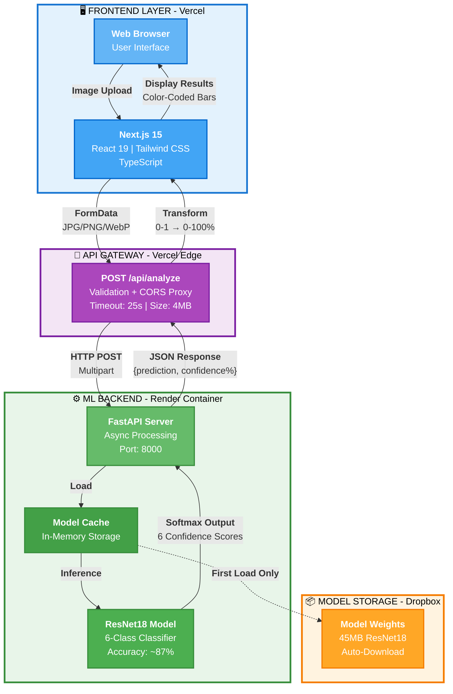

# Hld Professional

```mermaid

graph TB
    subgraph Frontend["🖥️ FRONTEND LAYER - Vercel"]
        direction TB
        A["<b>Web Browser</b><br/>User Interface"]
        B["<b>Next.js 15</b><br/>React 19 | Tailwind CSS<br/>TypeScript"]
    end
    
    subgraph Gateway["🔗 API GATEWAY - Vercel Edge"]
        direction TB
        C["<b>POST /api/analyze</b><br/>Validation + CORS Proxy<br/>Timeout: 25s | Size: 4MB"]
    end
    
    subgraph Backend["⚙️ ML BACKEND - Render Container"]
        direction TB
        D["<b>FastAPI Server</b><br/>Async Processing<br/>Port: 8000"]
        E["<b>ResNet18 Model</b><br/>6-Class Classifier<br/>Accuracy: ~87%"]
        F["<b>Model Cache</b><br/>In-Memory Storage"]
    end
    
    subgraph Storage["📦 MODEL STORAGE - Dropbox"]
        G["<b>Model Weights</b><br/>45MB ResNet18<br/>Auto-Download"]
    end
    
    A -->|"<b>Image Upload</b>"| B
    B -->|"<b>FormData</b><br/>JPG/PNG/WebP"| C
    C -->|"<b>HTTP POST</b><br/>Multipart"| D
    D -->|"<b>Load</b>"| F
    F -->|"<b>Inference</b>"| E
    E -->|"<b>Softmax Output</b><br/>6 Confidence Scores"| D
    D -->|"<b>JSON Response</b><br/>{prediction, confidence%}"| C
    C -->|"<b>Transform</b><br/>0-1 → 0-100%"| B
    B -->|"<b>Display Results</b><br/>Color-Coded Bars"| A
    
    F -.->|"<b>First Load Only</b>"| G
    
    style Frontend fill:#e3f2fd,stroke:#1976d2,stroke-width:3px,color:#000
    style Gateway fill:#f3e5f5,stroke:#7b1fa2,stroke-width:3px,color:#000
    style Backend fill:#e8f5e9,stroke:#388e3c,stroke-width:3px,color:#000
    style Storage fill:#fff3e0,stroke:#f57c00,stroke-width:3px,color:#000
    
    style A fill:#64b5f6,stroke:#0066cc,stroke-width:2px,color:#fff
    style B fill:#42a5f5,stroke:#0066cc,stroke-width:2px,color:#fff
    style C fill:#ab47bc,stroke:#7b1fa2,stroke-width:2px,color:#fff
    style D fill:#66bb6a,stroke:#388e3c,stroke-width:2px,color:#fff
    style E fill:#4caf50,stroke:#388e3c,stroke-width:2px,color:#fff
    style F fill:#43a047,stroke:#388e3c,stroke-width:2px,color:#fff
    style G fill:#ffa726,stroke:#f57c00,stroke-width:2px,color:#fff

```
