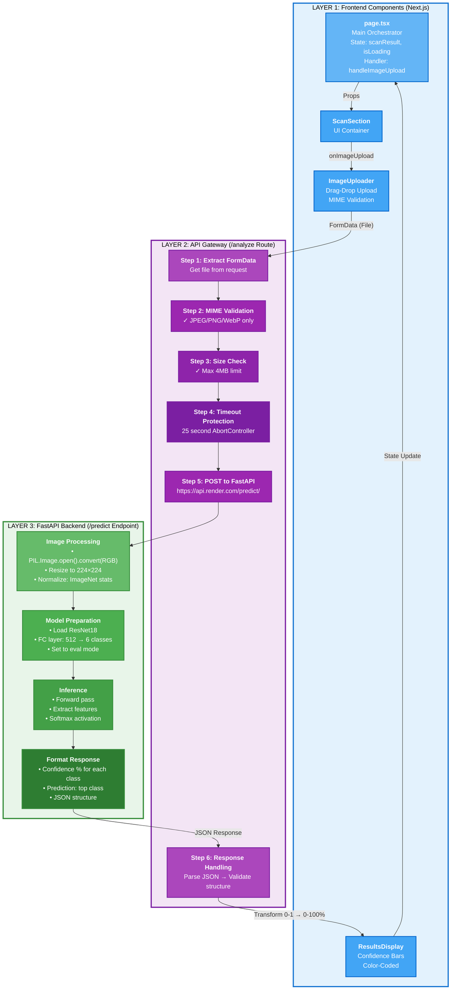

# Lld Professional

```mermaid

graph TB
    subgraph Layer1["LAYER 1: Frontend Components (Next.js)"]
        direction TB
        L1A["<b>page.tsx</b><br/>Main Orchestrator<br/>State: scanResult, isLoading<br/>Handler: handleImageUpload"]
        L1B["<b>ScanSection</b><br/>UI Container"]
        L1C["<b>ImageUploader</b><br/>Drag-Drop Upload<br/>MIME Validation"]
        L1D["<b>ResultsDisplay</b><br/>Confidence Bars<br/>Color-Coded"]
    end
    
    subgraph Layer2["LAYER 2: API Gateway (/analyze Route)"]
        direction TB
        L2A["<b>Step 1: Extract FormData</b><br/>Get file from request"]
        L2B["<b>Step 2: MIME Validation</b><br/>✓ JPEG/PNG/WebP only"]
        L2C["<b>Step 3: Size Check</b><br/>✓ Max 4MB limit"]
        L2D["<b>Step 4: Timeout Protection</b><br/>25 second AbortController"]
        L2E["<b>Step 5: POST to FastAPI</b><br/>https://api.render.com/predict/"]
        L2F["<b>Step 6: Response Handling</b><br/>Parse JSON → Validate structure"]
    end
    
    subgraph Layer3["LAYER 3: FastAPI Backend (/predict Endpoint)"]
        direction TB
        L3A["<b>Image Processing</b><br/>• PIL.Image.open().convert(RGB)<br/>• Resize to 224×224<br/>• Normalize: ImageNet stats"]
        L3B["<b>Model Preparation</b><br/>• Load ResNet18<br/>• FC layer: 512 → 6 classes<br/>• Set to eval mode"]
        L3C["<b>Inference</b><br/>• Forward pass<br/>• Extract features<br/>• Softmax activation"]
        L3D["<b>Format Response</b><br/>• Confidence % for each class<br/>• Prediction: top class<br/>• JSON structure"]
    end
    
    L1A -->|"Props"| L1B
    L1B -->|"onImageUpload"| L1C
    L1C -->|"FormData (File)"| L2A
    L2A --> L2B
    L2B --> L2C
    L2C --> L2D
    L2D --> L2E
    L2E --> L3A
    L3A --> L3B
    L3B --> L3C
    L3C --> L3D
    L3D -->|"JSON Response"| L2F
    L2F -->|"Transform 0-1 → 0-100%"| L1D
    L1D -->|"State Update"| L1A
    
    style Layer1 fill:#e3f2fd,stroke:#1976d2,stroke-width:3px,color:#000
    style Layer2 fill:#f3e5f5,stroke:#7b1fa2,stroke-width:3px,color:#000
    style Layer3 fill:#e8f5e9,stroke:#388e3c,stroke-width:3px,color:#000
    
    style L1A fill:#64b5f6,stroke:#0066cc,stroke-width:2px,color:#fff
    style L1B fill:#42a5f5,stroke:#0066cc,stroke-width:2px,color:#fff
    style L1C fill:#42a5f5,stroke:#0066cc,stroke-width:2px,color:#fff
    style L1D fill:#42a5f5,stroke:#0066cc,stroke-width:2px,color:#fff
    
    style L2A fill:#ab47bc,stroke:#7b1fa2,stroke-width:2px,color:#fff
    style L2B fill:#9c27b0,stroke:#7b1fa2,stroke-width:2px,color:#fff
    style L2C fill:#8e24aa,stroke:#7b1fa2,stroke-width:2px,color:#fff
    style L2D fill:#7b1fa2,stroke:#7b1fa2,stroke-width:2px,color:#fff
    style L2E fill:#9c27b0,stroke:#7b1fa2,stroke-width:2px,color:#fff
    style L2F fill:#ab47bc,stroke:#7b1fa2,stroke-width:2px,color:#fff
    
    style L3A fill:#66bb6a,stroke:#388e3c,stroke-width:2px,color:#fff
    style L3B fill:#4caf50,stroke:#388e3c,stroke-width:2px,color:#fff
    style L3C fill:#43a047,stroke:#388e3c,stroke-width:2px,color:#fff
    style L3D fill:#2e7d32,stroke:#388e3c,stroke-width:2px,color:#fff

```
