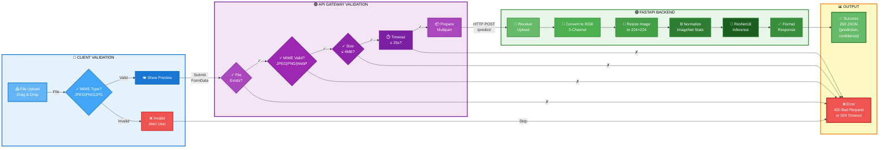

# Security Professional

```mermaid

graph LR
    subgraph Client["🔵 CLIENT VALIDATION"]
        direction TB
        A["📤 File Upload<br/>Drag & Drop"]
        B{"✓ MIME Type?<br/>JPEG|PNG|JPG"}
        C["👁️ Show Preview"]
        D["❌ Invalid<br/>Alert User"]
    end
    
    subgraph API["🟣 API GATEWAY VALIDATION"]
        direction TB
        E{"✓ File<br/>Exists?"}
        F{"✓ MIME Valid?<br/>JPEG|PNG|WebP"}
        G{"✓ Size<br/>≤ 4MB?"}
        H["⏱️ Timeout<br/>≤ 25s?"]
        I["📦 Prepare<br/>Multipart"]
    end
    
    subgraph Backend["🟢 FASTAPI BACKEND"]
        direction TB
        J["📨 Receive<br/>Upload"]
        K["🔄 Convert to RGB<br/>3-Channel"]
        L["📐 Resize Image<br/>to 224×224"]
        M["⚙️ Normalize<br/>ImageNet Stats"]
        N["🧠 ResNet18<br/>Inference"]
        O["✅ Format<br/>Response"]
    end
    
    subgraph Output["📊 OUTPUT"]
        direction TB
        P["✅ Success<br/>200 JSON<br/>{prediction,<br/>confidence}"]
        Q["❌ Error<br/>400 Bad Request<br/>or 504 Timeout"]
    end
    
    A -->|"File"| B
    B -->|"Valid"| C
    B -->|"Invalid"| D
    C -->|"Submit<br/>FormData"| E
    D -->|"Stop"| Q
    
    E -->|"✓"| F
    E -->|"✗"| Q
    F -->|"✓"| G
    F -->|"✗"| Q
    G -->|"✓"| H
    G -->|"✗"| Q
    H -->|"✓"| I
    H -->|"✗"| Q
    
    I -->|"HTTP POST<br>/predict/"| J
    J --> K
    K --> L
    L --> M
    M --> N
    N --> O
    O --> P
    
    style Client fill:#e3f2fd,stroke:#1976d2,stroke-width:3px,color:#000
    style API fill:#f3e5f5,stroke:#7b1fa2,stroke-width:3px,color:#000
    style Backend fill:#e8f5e9,stroke:#388e3c,stroke-width:3px,color:#000
    style Output fill:#fff9c4,stroke:#f57f17,stroke-width:3px,color:#000
    
    style A fill:#64b5f6,stroke:#0066cc,stroke-width:2px,color:#fff
    style B fill:#42a5f5,stroke:#0066cc,stroke-width:2px,color:#fff
    style C fill:#1976d2,stroke:#0066cc,stroke-width:2px,color:#fff
    style D fill:#ef5350,stroke:#c62828,stroke-width:2px,color:#fff
    
    style E fill:#ab47bc,stroke:#7b1fa2,stroke-width:2px,color:#fff
    style F fill:#9c27b0,stroke:#7b1fa2,stroke-width:2px,color:#fff
    style G fill:#8e24aa,stroke:#7b1fa2,stroke-width:2px,color:#fff
    style H fill:#7b1fa2,stroke:#7b1fa2,stroke-width:2px,color:#fff
    style I fill:#ab47bc,stroke:#7b1fa2,stroke-width:2px,color:#fff
    
    style J fill:#66bb6a,stroke:#388e3c,stroke-width:2px,color:#fff
    style K fill:#4caf50,stroke:#388e3c,stroke-width:2px,color:#fff
    style L fill:#43a047,stroke:#388e3c,stroke-width:2px,color:#fff
    style M fill:#2e7d32,stroke:#388e3c,stroke-width:2px,color:#fff
    style N fill:#1b5e20,stroke:#388e3c,stroke-width:2px,color:#fff
    style O fill:#388e3c,stroke:#388e3c,stroke-width:2px,color:#fff
    
    style P fill:#66bb6a,stroke:#2e7d32,stroke-width:3px,color:#fff
    style Q fill:#ef5350,stroke:#c62828,stroke-width:3px,color:#fff

```
